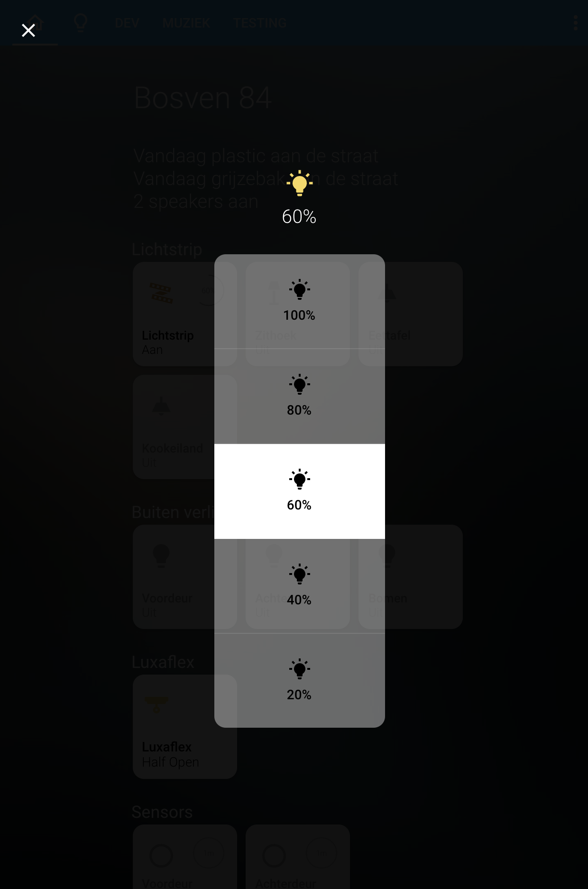
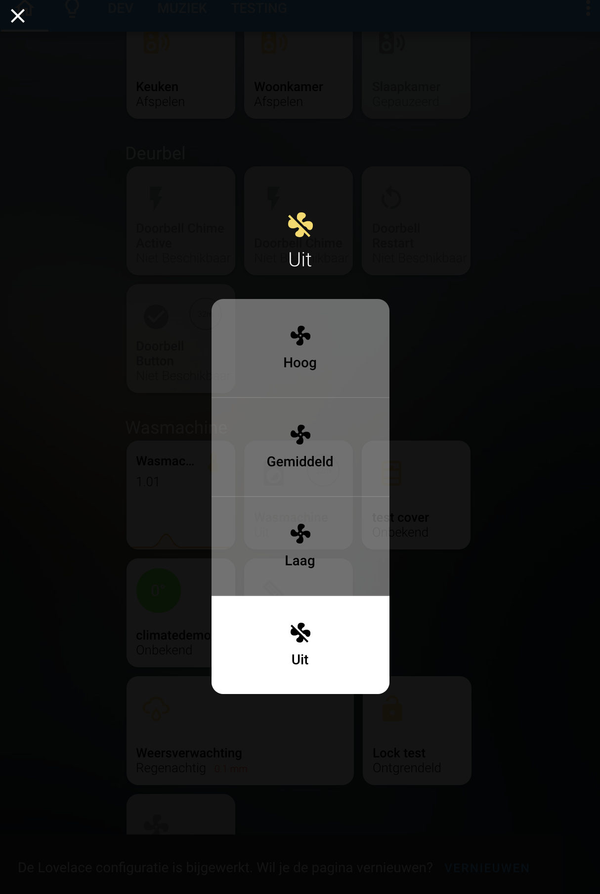
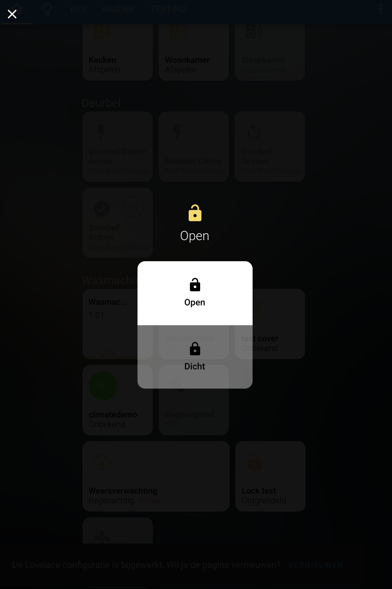

# Switch popup card (homekit style)

Example configuration light brightness
```
entity: light.beganegrond
popup:
    type: custom:switch-popup-card
    icon: "mdi-lightbulb"
    noActiveState: '-'
    entity_value_path: attributes.brightness
    service: light.turn_on
    service_data:
    entity_id: this
    brightness: value
    entities:
    - light.beganegrond
    buttons:
    - icon: "mdi:lightbulb-on"
        value: 255
        name: "100%"
        color: "#FFF"
        icon_color: "rgba(255,255,255,1)"
    - icon: "mdi:lightbulb-on"
        value: 204
        name: "80%"
        color: "#FFF"
        icon_color: "rgba(255,255,255,0.8)"
    - icon: "mdi:lightbulb-on"
        value: 153
        name: "60%"
        color: "#FFF"
        icon_color: "rgba(255,255,255,0.6)"
    - icon: "mdi:lightbulb-on"
        value: 102
        name: "40%"
        color: "#FFF"
        icon_color: "rgba(255,255,255,0.4)"
    - icon: "mdi:lightbulb-on"
        value: 51
        name: "20%"
        color: "#FFF"
        icon_color: "rgba(255,255,255,0.2)"
```




Example configuration fan speed
```
entity: fan.fan_test
popup:
    type: custom:switch-popup-card
    icon: "mdi-fan"
    noActiveState: '-'
    entity_value_path: attributes.speed
    service: fan.set_speed
    service_data:
    entity_id: this
    speed: value
    entities:
    - fan.fan_test
    buttons:
    - icon: "mdi:fan"
        value: 'high'
        name: "Hoog"
        color: "#FFF"
        icon_color: "rgba(255,255,255,1)"
    - icon: "mdi:fan"
        value: 'medium'
        name: "Gemiddeld"
        color: "#FFF"
        icon_color: "rgba(255,255,255,1)"
    - icon: "mdi:fan"
        value: 'low'
        name: "Laag"
        color: "#FFF"
        icon_color: "rgba(255,255,255,1)"
    - icon: "mdi:fan-off"
        value: 'off'
        name: "Uit"
```




Example configuration lock
```
entity: lock.lock_test
popup:
    type: custom:switch-popup-card
    noActiveState: '-'
    entity_value_path: state
    entities:
    - lock.lock_test
    buttons:
    - icon: "mdi:lock-open"
        value: "unlocked"
        name: "Open"
        color: "#FFF"
        icon_color: "rgba(255,255,255,1)"
        service: lock.unlock
        service_data:
        entity_id: this
    - icon: "mdi:lock"
        value: "locked"
        name: "Dicht"
        color: "#FFF"
        icon_color: "rgba(255,255,255,1)"
        service: lock.lock
        service_data:
        entity_id: this
```

